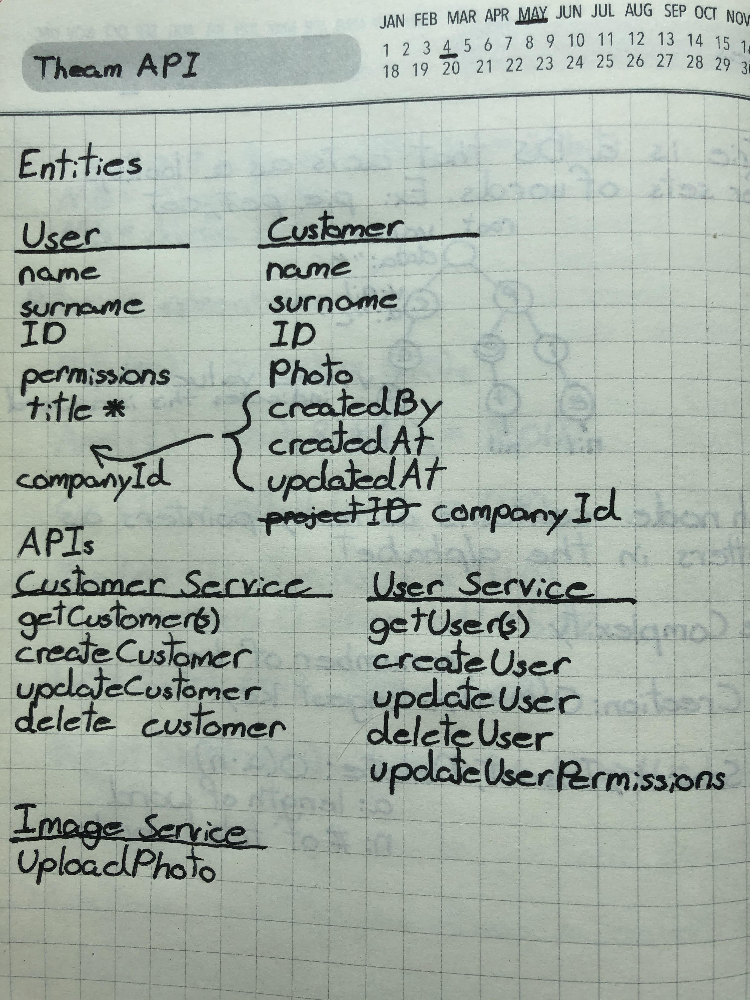
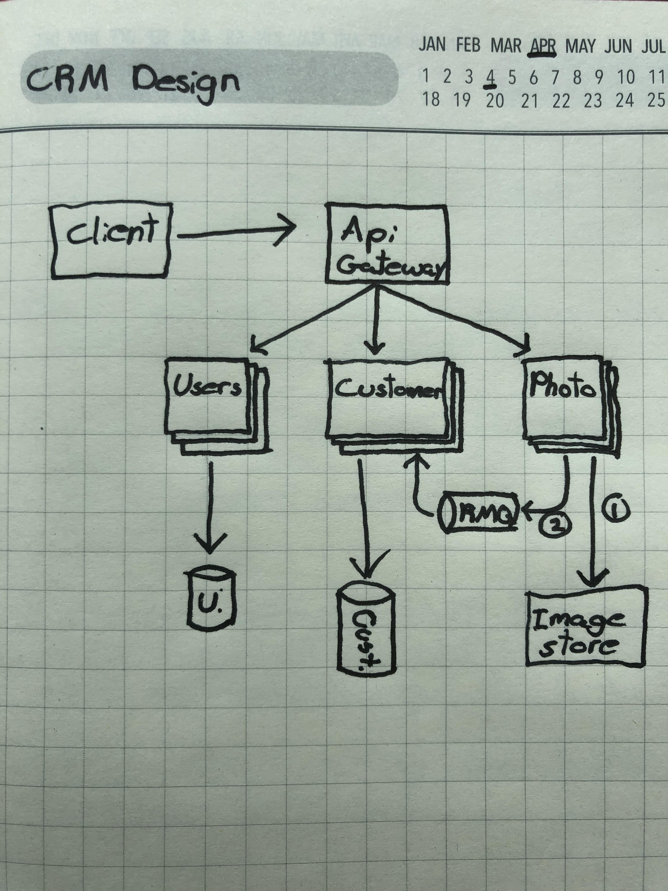

# CRM API

This app is the backend for a CRM service that allows users to view customers

## Getting Started With Docker

These apps are built to work with `docker` and `docker-compose` so that the whole ecosystem can be run locally.

If you would like to run things locally without docker (not recommended), see the section at the bottom on [Getting Started Without Docker](#getting-started-without-docker).

### Prerequisites

If you haven't already, download and install [Docker](https://www.docker.com/products/docker-desktop) and [Docker Compose](https://docs.docker.com/compose/install/).

Once you have docker installed, you will need to create a `.env` file for each service you would like to run (`user`, `customer`, `photo`). The recommended settings are stored in the README of each respective service.

There should also be a `.env` at the top level folder where the `docker-compose.yml` file is with the following values:

```bash
GATEWAY_PORT=80
CUSTOMER_PORT=1500
USER_PORT=2020
PHOTO_PORT=3333
STORAGE_PORT=9000
MONGO_PORT=27017
```

### A Note for Mac Users

Before running the apps via docker you will need to change lines 39, 40, and 44 from:
```bash
c:/data/...:data/...
```
to:
```bash
/path/to/data/...:data/...
```

### Running

To get all the services running at once, the following command will set up and run everything:

```bash
docker-compose up
```

Please note that the first time running this command will take slightly longer.

Now that the apps and supporting services are up and running, you can go to the specified ports on localhost to see the swagger docs for each service.


## Using the App

The app includes a small gateway that is designed to be replaced by a cloud provider gateway (e.g. AWS API Gateway, etc). All requests for the application can go through `localhost:8080`.

Once everything is running, you can go to the following swagger documents:
```bash
localhost:8080/user-swagger
localhost:8080/customer-swagger
localhost:8080/photo-swagger
```

### Auth

The app includes a method of verifying a user's access via a JWT. However, assuming that we use a third-party provider for login/auth, I have not included that functionality in this app. For now, we ca obtain a JWT by going to (jwt.io)[https://jwt.io], and putting in the following values for the payload:

```ts
  "iat": 1588905546,
  "exp": 1620441546,
  "sub": "5eb4a2dce57e2e196c6793ae",
  "role": "ADMIN"
```

Make sure to specify the same value for the secret as what is in your `JWT_SECRET` env variable.

## Getting Started Without Docker

Docker is recommended for this system, however if it is not available then following the instructions below will get you up and running.

### Prerequisites

You will need to download and install each of the following in order to run the apps:

* [Node.js](https://nodejs.org/en/download/)
* [MongoDB](https://www.mongodb.com/download-center/community)
* [Minio](https://min.io/download#/windows)

Once you have each installed, you will need to create a `.env` file for each service you would like to run (`user`, `customer`, `photo`). The recommended settings are stored in the README of each respective service.

### Running

For running the applications, we will need several terminals to run the different processes. In the first terminal, run MongoDB. The default settings are sufficient for a local run:

```bash
mongod
```

You will also need an additional terminal to run our S3-style object store:

```bash
minio server /path/to/data
```

next, for each service you will need to install the node modules before running it:

```bash
npm install && npm start
```

optionally, if you would also like to run the gateway, it will also work with the usual `npm start` command. Please note that the gateway is designed to be replaced in a production environment, so it only has hard-coded values for the service port configurations.

Repeat in a new terminal for the user, customer, and photo services.

And that's it! You should be able to see all of the swagger documents if you go to a service's port in your browser.

## High Level Design and APIs

This project was designed with the following considerations and assumptions:

Considerations:
* The codebase should be as decoupled and scalable as possible.
* To promote decoupling, services will not call each other directly.
* The APIs will be humanly readable and useable as possible.

Assumptions:
* All users will belong to a company. However company APIs may be outside the scope of this project. I will add APIs for creating/updating companies if time allows.
* All users and admin users belonging to a company have permissions see all of their customers.

### APIs
[Apis and Entities](#apis-and-entities)

Above are the initial designs for the entities and available APIs, the entities may undergo some change but the APIs will stay the same. 

Please note that I have not included any Auth APIs at this time.

### Design
[Initial high level design](#initial-high-level-design)

The design for this application should generally be straightforward. All CRUD operations for Users and Customers will go through their respective services. However I would like to call attention to the photo upload flow.

There are two possibilities for implementing the photo upload/management flow.

First, this is the rough draft of the API for uploading a photo
```
uploadPhoto(imageData, customerId=null)
```

**Option 1**: The frontend application will call into the `uploadPhoto` API with the image data and no `customerId`. In this case the photo will be uploaded to the image store and the path to it will be returned to the frontend. From there the FE can call out to `updateCustomer` with the new image path.

**Option 2**: The frontend application will call into the `uploadPhoto` API with the image data and a `customerId`. Upon seeing the `customerId` the Photo Service will upload the image to the image store and add a message to RMQ to update the customer. The Customer Service will grab the message and add the photo path to the given customer document

There will only be photo uploads for customer documents at this time. However, should this requirement change we will only need to add a optional `photo` property to user documents.

**Update**: It seems that the addition of RMQ in this design was overly complex where it didn't need to be. Instead, I have left the option open for implementing RMQ down the line should it be deemed necessary. For now the calls to upload the photo and update the user can be managed by the frontend.

## Running the tests

TBD

## Deployment

TBD

## Built With

* [Nest.js](https://docs.nestjs.com/) - The web framework used

## Authors

* **Joel Milligan** - [Joelsalt](https://github.com/joelsalt)

## License

This project is licensed under the MIT License - see the [LICENSE.md](LICENSE.md) file for details

# Apis and Entities


# Initial High Level Design

